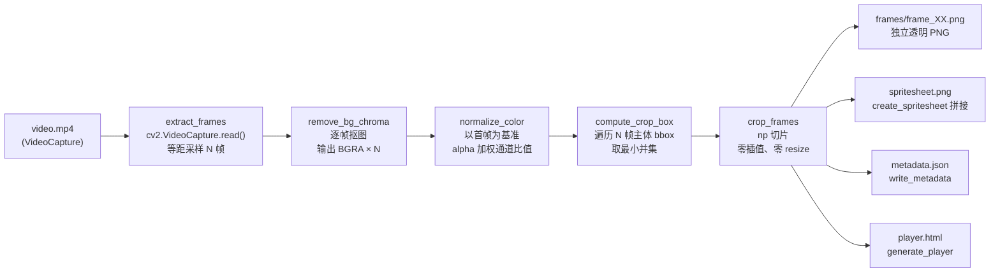
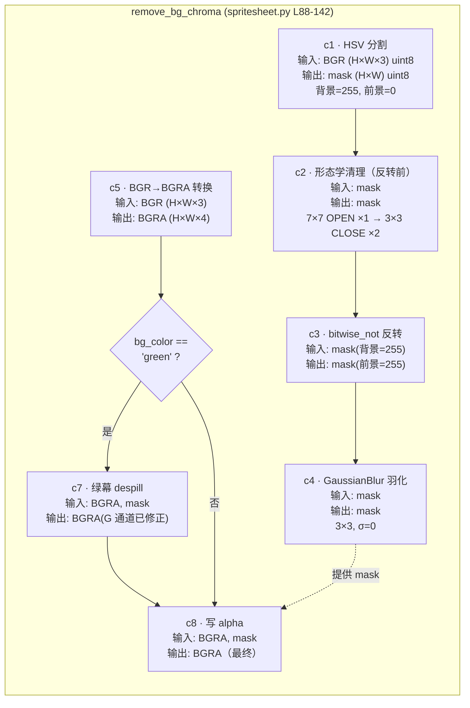
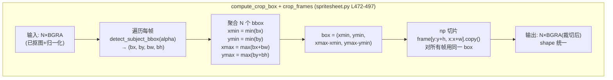
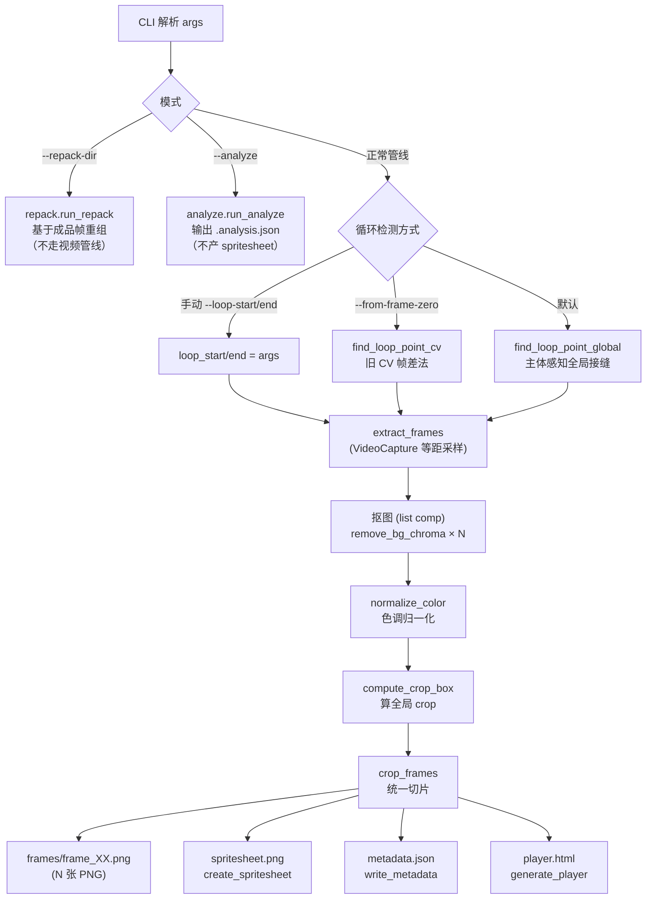

# 抠图与裁剪流程参考

> 本文档详细描述 spritesheet 处理流水线的内部步骤、每步的输入/输出、算子参数与设计意图。
> 适用代码：`spritesheet/scripts/`（主入口 `spritesheet.py` + `chroma.py` / `subject.py` / `loopdetect.py` / `analyze.py` / `repack.py`）
> 涉及函数：`extract_frames` / `remove_bg_chroma`(chroma) / `detect_subject_info`(subject) / `find_loop_point_global`(loopdetect) / `normalize_color` / `compute_crop_box` / `crop_frames` / `write_metadata`

## 1. 流水线总览

**如何阅读**：图中 `E` 之前的步骤是「读取」，`R/N` 是「逐元素变换」（输出仍是 N 帧列表），`B/F` 是「跨帧统一」（先聚合再切片）。只有 `F` 之后才落盘。

**内存/落盘边界**：
- **内存**：`extract_frames` → `remove_bg_chroma` → `normalize_color` → `compute_crop_box` → `crop_frames`
- **落盘**：`frames/*.png`（N 张）+ `spritesheet.png` + `metadata.json` + `player.html`

---

## 2. 抠图 `remove_bg_chroma` — 7 步

### 2.1 流程图

**如何阅读**：`c1→c2→c3→c4` 是 mask 流水线（背景→清理→反转→羽化），`c5→c6→[c7]→c8` 是图像流水线（彩色→条件 despill→写 alpha），两条线在 `c8` 汇合。

### 2.2 I/O 表

| step | 输入 (类型 / 形状 / 值域) | 输出 (类型 / 形状 / 值域) | 算子与参数 | 设计意图 |
|------|--------------------------|--------------------------|------------|----------|
| **c1** HSV 分割 | `np.ndarray` BGR `(H, W, 3)` uint8, `[0, 255]` | `np.ndarray` mask `(H, W)` uint8, `{0, 255}` | `cv2.cvtColor(BGR→HSV)` + `cv2.inRange` 多次按位或 | 色相分割抗亮度变化；按 `BG_HSV_RANGES` 多区间合并覆盖标准+过曝绿幕 |
| **c2** 形态学清理（反转前） | mask `(H, W)` | mask `(H, W)` | `MORPH_OPEN` 椭圆核 `7×7 ×1` → `MORPH_CLOSE` 椭圆核 `3×3 ×2` | 大核先抹掉反光碎屑、压缩孤立白斑；小核再补细洞；放在反转前避免 CLOSE 把前景「贴大」 |
| **c3** 反转 | mask `(H, W)`，背景=255 | mask `(H, W)`，前景=255 | `cv2.bitwise_not` | 业务语义切换：抠图要的是「主体 mask」 |
| **c4** 羽化 | mask `(H, W)` | mask `(H, W)`，值域 `[0, 255]` | `cv2.GaussianBlur((3, 3), 0)` | 3×3 模糊在透明边生成渐变带，合成时无白边/硬边；σ=0 让 OpenCV 自适应 |
| **c5** BGR→BGRA | `np.ndarray` BGR `(H, W, 3)` | `np.ndarray` BGRA `(H, W, 4)` | `cv2.cvtColor(BGR→BGRA)` | 开辟 alpha 通道容器；新 alpha 暂时未定义，由 c8 写入 |
| **c6** 条件分支 | `bg_color: str` | 路由 | `if bg_color == "green"` | despill 仅对绿幕有意义；其他色幕 G 通道本就是前景色 |
| **c7** 绿幕 despill | BGRA `(H, W, 4)` + mask `(H, W)` | BGRA `(H, W, 4)`，G 通道修正 | 见下方「2.3 despill 子表」 | 压制绿幕光晕渗透到主体内部与边缘；保留高光与中性色 |
| **c8** 写 alpha | BGRA `(H, W, 4)` + mask `(H, W)` | BGRA `(H, W, 4)`，alpha=mask | `bgra[:, :, 3] = mask` | 把 c4 得到的 mask 落进 c5 开辟的 alpha 通道 |

### 2.3 despill 内部子表（c7 展开）

| 区域 | mask 范围 | 条件 | 目标 G | 设计意图 |
|------|----------|------|--------|----------|
| 主体核心 | `mask ≥ 240` | `G > B+5 & G > R+5`（**双向**） | `max(B, R, (B+R)/2)` | 衣领/裆部等暗褶皱里 G 比 R 高 5-30；用双向条件只压制「真偏绿」像素，避免把暖色衣物压成死灰 |
| 主体边缘 | `0 < mask < 240` | `G > B+1 \| G > R+1`（**单向**） | `max(B, R, (B+R)/2)` | 过渡区 G 普遍偏高 1+，单向条件即可；目标 G 取 max 而非 min，**避免压出死黑** |
| 透明区域 | `mask == 0` | 不参与 | — | 透明处后续会被覆盖，无需 despill |

**关键不变量**：`target_g ≥ max(b_i, r_i)`，且 `target_g ≤ max(b_i, r_i, (b_i + r_i) // 2 + δ)`，保证 despill 后 G 不会比红蓝通道还暗，**避免「黑边」伪影**。

### 2.4 形态学位置对比

| 维度 | 旧（HEAD `8e06f33`） | 新（未提交） |
|------|----------------------|--------------|
| 位置 | 反转**后**（在前景 mask 上） | 反转**前**（在背景 mask 上） |
| 算子顺序 | CLOSE ×2 → OPEN ×1 | OPEN ×1 → CLOSE ×2 |
| 核尺寸 | 单一 5×5 | 大核 7×7 OPEN + 小核 3×3 CLOSE |
| 视觉效果 | 主体边缘外扩、可能吃掉发丝 | 主体边缘贴合、碎屑更净 |

形态学对二值 mask 自对偶（`morph(open, X) = morph(close, ¬X)` 在视觉上等价），但**反转前的 CLOSE 修的是背景洞，反转后变成「补前景洞」**，二者效果差异显著——尤其在主体有镂空（耳环、镂空花纹）时。

---

## 3. 色调归一化 `normalize_color` — 1 步概要

### 3.1 流程图

### 3.2 I/O 表

| step | 输入 | 输出 | 算子 | 关键不变量 |
|------|------|------|------|------------|
| **n1** 计算 ref 均值 | 首帧 `BGRA (H, W, 4)` | `ref_mean: (3,)` float, BGR 通道 | `cv2.mean(BGR, alpha.astype(uint8))` | alpha 加权：只统计主体像素，跳过透明背景 |
| **n2** 通道比值校正 | 后续帧 `BGRA (H, W, 4)` | 同形状 BGR 通道已校正 | `BGR[c] *= ref_mean[c] / max(frame_mean[c], 1)` | `max(..., 1)` 防 0 除；分通道独立缩放 |
| **n3** 拼回 BGRA | BGR + 原始 alpha | `BGRA (H, W, 4)` | `np.clip(BGR, 0, 255)` + `.copy()` | 几何不参与；只调曝光/色调 |

**说明**：归一化**不**改变帧间主体大小、位置或 alpha mask，**不**做几何变换；它的作用是消除帧间灯光抖动，让循环播放更稳。

---

## 4. 统一裁剪 `compute_crop_box` + `crop_frames` — 2 步

### 4.1 流程图

**如何阅读**：`u1→u2→u3` 是「算框」阶段（1 次扫描得到全局最优），`u4` 是「裁切」阶段（纯 numpy 切片，零插值）。

### 4.2 I/O 表

| step | 输入 | 输出 | 算子 | 关键不变量 |
|------|------|------|------|------------|
| **u1** 逐帧 bbox | BGRA `(H, W, 4)` | `(bx, by, bw, bh): (4,)` int | `cv2.findNonZero(alpha) → cv2.boundingRect` | alpha 全 0 时返回整图（`W, H`） |
| **u2-u3** 聚合求并集 | `N × (bx, by, bw, bh)` | `box: (x, y, w, h)` | min/max 标量 | `box` 保证**所有帧**主体完整可见；**无 padding** |
| **u4** 切片 | `N × BGRA` + `box` | `N × BGRA(裁切后)` | `frame[y:y+h, x:x+w].copy()` | 零插值、零 resize、零画布合成；每帧 shape 相同 |

### 4.3 副产物：`metadata.json` 字段

由 `write_metadata`（L500-524）写入：

| 字段 | 类型 | 来源 | 运行时用途 |
|------|------|------|------------|
| `frames` | int | `len(cropped)` | 帧总数 |
| `cols` | int | `args.cols` | spritesheet 列数 |
| `rows` | int | `ceil(frames / cols)` | spritesheet 行数 |
| `frame_w` | int | `cropped[0].shape[1]` | 单帧宽度 |
| `frame_h` | int | `cropped[0].shape[0]` | 单帧高度 |
| `crop.x` | int | `box[0]` | 运行时还原原图坐标（与视频源对齐） |
| `crop.y` | int | `box[1]` | 同上 |
| `crop.w` | int | `box[2]` | 裁切宽 |
| `crop.h` | int | `box[3]` | 裁切高 |
| `loop.start` | int | `loop_start` | 循环起始帧（视频源） |
| `loop.end` | int | `loop_end` | 循环结束帧 |
| `loop.method` | str | `manual` \| `global` \| `cv_from_zero` \| `repacked` | 循环检测方式 |
| `video` | str | `video_path` | 视频源绝对路径 |

### 4.4 与旧实现差异

| 维度 | 旧 `align_and_normalize` | 新 `compute_crop_box` + `crop_frames` |
|------|--------------------------|----------------------------------------|
| 处理粒度 | 单帧独立 | 跨帧统一 |
| 几何操作 | `cv2.resize` (LANCZOS4) + 黑底画布居中 | 纯 `np` 切片 |
| 输出尺寸 | 固定 `target_size × target_size` | 由主体决定（`frame_w × frame_h`） |
| 帧间主体大小 | 每帧独立缩放，可能有 ±1 像素抖动 | **所有帧完全一致** |
| 帧间主体位置 | 居中（基于单帧 bbox） | 同一全局 box |
| 像素插值 | 是（LANCZOS4） | **否**（保真） |
| 还原信息 | 无 | `metadata.crop` 可还原 |
| 循环播放 | 易出现「一抖一抖」 | 无抖动 |

---

## 5. 主流程 `main()` 整合

**关键路径编号**（与脚本内 `print("=== 步骤 N/9 ===")` 一一对应）：

| 编号 | print 标题 | 步骤 | 在内存？ | 落盘？ |
|------|-----------|------|---------|--------|
| 1 | 步骤 1/9: 循环检测 | `detect_loop` → `find_loop_point_global`（默认） | ✓ | ✗ |
| 2 | 步骤 2/9: 抽帧 | `extract_frames` | ✓ | ✗ |
| 3 | 步骤 3/9: 抠图 | `remove_bg_chroma` (list comp) | ✓ | ✗ |
| 4 | 步骤 4/9: 色调归一化 | `normalize_color` | ✓ | ✗ |
| 5 | 步骤 5/9: 算裁切框 | `compute_crop_box` | ✓ | ✗ |
| 6 | 步骤 6/9: 裁切 | `crop_frames` | ✓ | ✗ |
| 7 | 步骤 7/9: 输出碎图 | `cv2.imwrite` × N | — | ✓ |
| 8 | 步骤 8/9: 输出 spritesheet | `create_spritesheet` + `imwrite` | — | ✓ |
| 9 | 步骤 9/9: 输出 metadata + player | `write_metadata` + `generate_player` | — | ✓ |

---

## 6. 循环检测 `find_loop_point_global`（默认）— loopdetect.py

> 默认循环检测算法，替代旧 `find_loop_point_cv`。**自包含**：内部自己抽密集帧 + chroma key，
> 因为检测发生在主管线抠图（步骤 3）之前，拿不到 alpha。

### 6.1 为什么需要它

旧 `find_loop_point_cv` 两个缺陷：

| 缺陷 | 表现 | `find_loop_point_global` 的解法 |
|------|------|--------------------------------|
| 硬编码 `start=0` | 行走类动画首帧是静态空闲态，真实周期在视频中段，旧法从首帧找→误判 | **全局扫描所有 (start,end) 对**，不假设起点 |
| MSE 全画面灰度 | 背景像素稀释真实差异，产生"虚低"（怪2行走 idx0-8 的 MSE 被假报为 2.3） | **MSE 只在主体 mask 内计算**（背景置 0 不参与） |

### 6.2 流程

### 6.3 关键算子

| 步骤 | 算子 | 设计意图 |
|------|------|---------|
| mask 内全局 MSE | `D = sq[:,None]+sq[None,:]-2*G@G.T`，背景置 0 后只统计主体像素差 | 一次 BLAS 算全矩阵，比双层循环快 ~100×；排除背景虚低 |
| 质心 | `cv2.moments(mask)` | 判断原地行走（质心稳）vs 平移（质心线性漂移，给 bonus 抵消稳定性扣分） |
| 三因子评分 | `w_endpoint·sim + w_richness·richness + w_centroid·stability + w_translation·bonus` | 端点相似度主导（保证循环平滑），丰富度/质心辅助 |
| 回退 | mask 占比 < 5% 或最优端点相似度 < 0.5 → `find_loop_point_cv` | 主体分离失败时降级到全画面法 |

### 6.4 与诊断模式 `--analyze` 的关系

`find_loop_point_global(return_report=True)` 附带诊断 dict（MSE 矩阵摘要、质心轨迹、候选评分），`analyze.run_analyze` 复用之并补充帧差自相关（周期检测）与主体大小趋势（U 型波动 vs 持续放大），输出 `.analysis.json`。自动检测不可靠时据此手动指定 `--loop-start/--loop-end`。

---

## 附录 A：相关函数所在模块

> 函数已按职责拆分到多个模块（`spritesheet.py` 主入口 + 5 个子模块）。具体行号随重构变化，按模块定位。

| 函数 | 模块 |
|------|------|
| `remove_bg_chroma` / `detect_bg_color` / `BG_HSV_RANGES` | `chroma.py` |
| `detect_subject_info` / `detect_subject_bbox` / `subject_mask_grays` / `mask_mse_matrix` / `centroid_and_height` | `subject.py` |
| `find_loop_point_global` / `find_loop_point_cv` / `detect_loop` / `GlobalLoopConfig` | `loopdetect.py` |
| `run_analyze` / `find_period` / `analyze_size_trend` | `analyze.py` |
| `run_repack` / `parse_frame_spec` | `repack.py` |
| `extract_frames` / `normalize_color` / `compute_crop_box` / `crop_frames` / `write_metadata` / `create_spritesheet` / `generate_player` / `main` | `spritesheet.py` |
